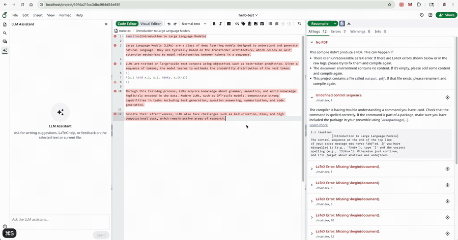

# Smart Overleaf

Smart Overleaf is a customized Overleaf Community Edition build with native LLM Assistant support. It is intended for labs, research groups, and internal university deployments that want collaborative LaTeX editing, local data control, and flexible AI assistance without paying for hosted Overleaf add-ons.

The original Overleaf README is preserved in [overleaf_README.md](overleaf_README.md).

## Demo



## Why This Project

Hosted Overleaf has several limitations for budget-sensitive users:

1. The free version can only share with up to 2 collaborators. More collaborators require a paid plan, starting around USD 28 per month.
2. AI features such as polishing, translation, and grammar correction require a paid AI Assist plan, starting around USD 16 per month, and the model cannot be freely selected.
3. Compilation can be slow unless you pay for better performance.
4. Privacy is limited because all project data is stored in Overleaf's hosted database.

Local LaTeX workflows such as VS Code + LaTeX + LLM plugins also have practical limitations:

1. Finished papers cannot be shared and edited online in real time. Exported PDFs are not suitable for collaborative editing.
2. Local LaTeX setup is tedious.
3. The UI is less friendly for users who are already familiar with Overleaf.

This project is based on the official open-source Overleaf Community Edition and adds native LLM support. It is a lightweight, self-hosted alternative for users who want an affordable Overleaf-like workflow.

Advantages:

1. Fully open source and free to use.
2. Supports LLM-based polishing, translation, grammar correction, and writing suggestions.
3. Supports switching between OpenAI-compatible LLM APIs and models.
4. Supports campus intranet deployment and multi-user collaboration inside a trusted network.
5. Makes better use of idle lab or department servers.
6. Provides a familiar Overleaf-style UI and avoids complex local LaTeX setup.
7. Runs with Docker, making server deployment simple.

## Deployment Guide

This document explains how to run this customized Overleaf CE build outside the development environment. Do not use `develop/bin/up` or `develop/bin/dev` for a real deployment.

## 1. Basic Requirements

Recommended server sizes for internal university or small-team use:

| Scenario | Recommended server |
| --- | --- |
| Lab or research group | 4-8 vCPU / 16GB RAM / 200GB SSD |
| Department use | 8-16 vCPU / 32GB RAM / 500GB SSD |
| Campus-level concurrent use | 16+ vCPU / 64GB+ RAM, and consider service split or Server Pro |

Prepare:

- Ubuntu Server 22.04/24.04 LTS
- Docker Engine and Docker Compose plugin
- Internal DNS name, for example `overleaf.example.edu.cn`
- HTTPS certificate, from the university CA, internal CA, or Let's Encrypt DNS validation
- SMTP service for registration, invitations, and password reset emails
- LLM API service for the LLM Assistant feature
- Backup storage, preferably on a different disk or another server

Note: Overleaf CE is suitable for trusted users. Do not expose it directly to uncontrolled public users.

## 2. Install Docker

Install Docker Engine and the Docker Compose plugin before starting Overleaf.

On Ubuntu, a minimal setup is:

```bash
sudo apt-get update
sudo apt-get install -y ca-certificates curl gnupg

curl -fsSL https://get.docker.com | sudo sh
sudo usermod -aG docker "$USER"
```

Log out and log back in, then verify:

```bash
docker version
docker compose version
```

## 3. Start With Overleaf Toolkit

This repository includes two helper scripts so you can still use Overleaf Toolkit with `bin/up -d`.

Run these commands from this customized Overleaf repository:

```bash
cd /path/to/overleaf

bin/build-production-image
bin/setup-toolkit ../overleaf-toolkit
cd ../overleaf-toolkit
bin/up -d
```

After the first start, create an administrator account:

```bash
bin/docker-compose exec sharelatex bash -lc 'cd /overleaf/services/web && node modules/server-ce-scripts/scripts/create-user.mjs --admin --email=admin@example.edu.cn'
```

The command prints an activation link. Open it in the browser and set the password. To reset the account password, run the command again and use the new activation link.

Open:

```text
http://localhost
```

## 4. Backup

Back up at least:

- MongoDB: users, project metadata, permissions, history indexes
- Overleaf data directory: project files, uploads, history blobs, compile-related data
- Toolkit config directory: `config/overleaf.rc`, `config/variables.env`, `config/version`

Create a backup script in the Toolkit directory:

```bash
cat > backup.sh <<'EOF'
#!/usr/bin/env bash
set -euo pipefail

cd "$(dirname "$0")"

ts="$(date +%Y%m%d-%H%M%S)"
backup_dir="./backups/$ts"
mkdir -p "$backup_dir"

bin/docker-compose exec -T mongo mongodump \
  --db sharelatex \
  --archive \
  --gzip > "$backup_dir/mongo-sharelatex.archive.gz"

tar -czf "$backup_dir/config.tar.gz" config
tar -czf "$backup_dir/data.tar.gz" data

find ./backups -mindepth 1 -maxdepth 1 -type d -mtime +30 -exec rm -rf {} +
EOF

chmod +x backup.sh
```

Run it once manually:

```bash
./backup.sh
```

Add a cron job, for example daily at 02:00:

```bash
crontab -e
```

```cron
0 2 * * * cd /path/to/overleaf-toolkit && ./backup.sh >> backup.log 2>&1
```

Sync backups to NAS, object storage, or another server. Do not keep the only copy on the same disk as the Overleaf host.
